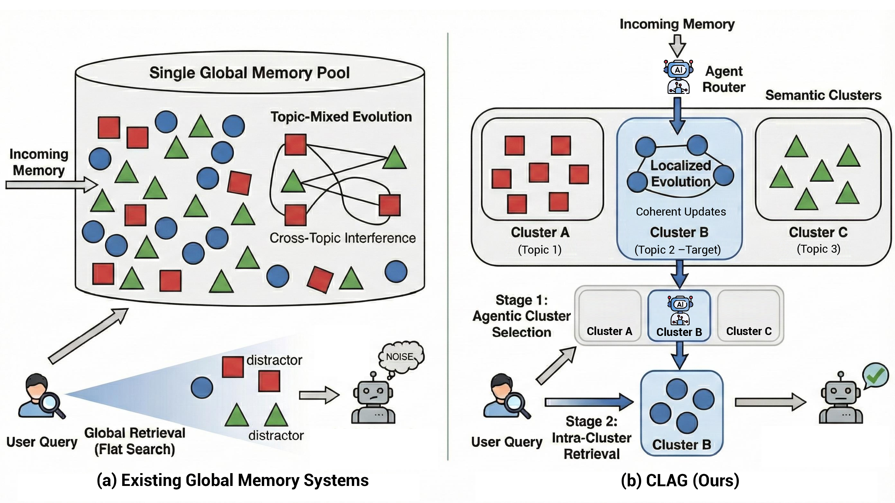
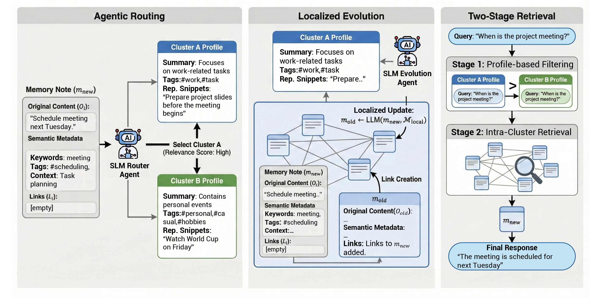

# CLAG: Adaptive Memory Organization via Agent-Driven Clustering for Small Language Model Agents

[]()
[]()
[]()

<!-- > Official implementation of **CLAG**, a cluster-aware memory framework for small language model agents. -->

CLAG is a memory framework for **small language model (SLM) agents** that organizes long-horizon memory through **agent-driven clustering**. 

CLAG employs an SLM-driven router to assign incoming memories to semantically coherent clusters and autonomously generates cluster-specific profiles—including topic summaries and descriptive tags—to establish each cluster as a self-contained functional unit.



<!-- ([PDF](figure/motivation_figure.pdf)) -->


---

## Overview

CLAG addresses this problem with three key components:

- **Agentic Routing**: routes each new memory into the most appropriate semantic cluster
- **Localized Evolution**: refines and consolidates memories only within the routed cluster
- **Cluster-Aware Two-Stage Retrieval**: first selects relevant clusters, then retrieves fine-grained evidence only inside them


<!-- ([PDF](figure/main_figure.pdf)) -->

---

## Repository Structure
```text
.
├── CLAG_memory.py                  # CLAG memory implementation
├── test_CLAG.py                    # Main evaluation / experiment entry point
├── prepare_bioasq.py               # BioASQ preprocessing
├── prepare_bioasq_gold_context.py  # BioASQ preprocessing utilities
├── run_prepare_bioasq_all.sh       # BioASQ preprocessing pipeline
├── data/                           # Datasets and processed files
├── logs_CLAG/                      # Experiment logs
├── results_CLAG/                   # Output results
└── figure/                         # README figures
```

---

## Installation

### Requirements

- Python **3.9+** recommended

### Setup

```bash
git clone https://github.com/<your-org-or-user>/CLAG.git
cd CLAG

python -m venv .venv
source .venv/bin/activate

pip install -r requirements.txt
```

> **Note**  
> Some NLTK resources may be downloaded at runtime if they are not already installed.

---

## Data Preparation

### Included datasets

The following datasets are already included under `data/`:

- **HotpotQA**
- **LoCoMo**

### BioASQ

BioASQ is **not distributed** with this repository. Please download the required files from the official BioASQ participant area:

- **training10b**
- **test dataset**

After downloading, place the files under `data/` and run:

```bash
bash run_prepare_bioasq_all.sh
```

This script generates processed files under `data/processed/`, including chunked versions used in the experiments.

---

## Quickstart

Run CLAG evaluation with:

```bash
python3 test_CLAG.py \
  --dataset data/locomo10.json \
  --backend sglang \
  --model gpt-4o-mini
```

### Common arguments

- `--dataset`: path to the evaluation dataset JSON
- `--backend`: backend to use (`openai`, `ollama`, or `sglang`)
- `--model`: model name for the selected backend
- `--output`: path to save output JSON
- `--ratio`: evaluate only a subset of the dataset (`0.0` to `1.0`)
- `--retrieve_k`: retrieval top-k (default: `10`)

---

## Backend Setup

### OpenAI backend

```bash
export OPENAI_API_KEY="YOUR_KEY"
```

### SGLang backend

By default, CLAG expects an SGLang server at:

```text
http://localhost:30000
```

You can override this with:

- `--sglang_host`
- `--sglang_port`

### Ollama backend

Make sure your Ollama server is running locally and the specified model is available.

## Reproducibility

To reproduce the main experiments, use `test_CLAG.py` with the target dataset and backend configuration.


<!-- ## Citation

If you find this repository useful, please cite:

```bibtex
@article{roh2026clag,
  title={CLAG: Adaptive Memory Organization via Agent-Driven Clustering for Small Language Model Agents},
  author={Roh, Taeyun and Jang, Wonjune and Jung, Junha and Kang, Jaewoo},
  journal={arXiv preprint arXiv:xxxx.xxxxx},
  year={2026}
}
``` -->
